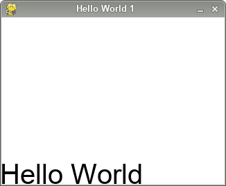
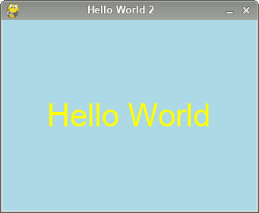
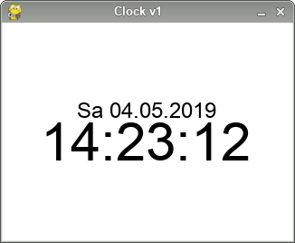
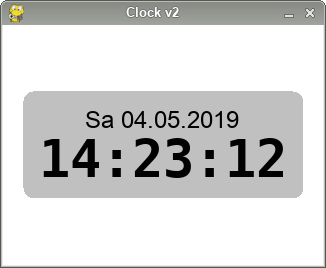

Pygame-fbgui User's Guide
=========================

Overview
--------

The library consists of four types of classes:

  - `App`: For every application there is only one instance of this
    class. The class (or a subclass) runs the event-loop and is owner
    of the physical screen.
  - `Widgets`: This is a tree of classes implementing the user-interface
  - `Settings`: A value-holder class used to configure applications and
    widgets.
  - Some support classes

You usually subclass `App` and create an instance of it. Then you create
the widget-tree, add it to the application and start the event-loop of
the application.

In the `files/usr/local/lib/fbgui/demo` directory you can find a number
of demo-programs. Each program usually implements one aspect of the
library. The demo-programs can be used as templates for your own
implementation.

Hello World
-----------

As always, let's start with a simple "Hello World" program:

    #!/usr/bin/python3

    import fbgui

    if __name__ == '__main__':

      config            = fbgui.Settings()
      config.msg_level  = "DEBUG"
      config.font_size  = 40
      config.width      = 320
      config.height     = 240
      config.title      = "Hello World 1"

      app   = fbgui.App(config)
      label = fbgui.Label("id1","Hello World",toplevel=True)
      label.pack()
      app.set_widget(label)
      app.run()

The background is filled with the default background color white, the label
takes up the complete screen and prints with the default alignment.
We will now center the label and change the colors:

    #!/usr/bin/python3

    import fbgui

    if __name__ == '__main__':

      config            = fbgui.Settings()
      config.msg_level  = "DEBUG"
      config.bg_color   = fbgui.Color.LIGHTBLUE
      config.fg_color   = fbgui.Color.WHITE
      config.font_size  = 40
      config.width      = 320
      config.height     = 240
      config.title      = "Hello World 2"
    
      app   = fbgui.App(config)
      label = fbgui.Label("id1","Hello World",
                          settings=fbgui.Settings({
                            'align': (fbgui.CENTER,fbgui.CENTER),
                            'fg_color': fbgui.Color.YELLOW
                          }),toplevel=True)
      label.pack()
      app.set_widget(label)
      app.run()

This example demonstrates two things: you can create and populate the settings
for an object using assignments (variable `config`) or by using an dictionary
(configuration of the label). You can also see that the theming for the
label-widget (foreground color yellow) overrides the default theming of the
application (forground color white).

Somtimes settings take tuples *and* scalars. Alignment is done in two
dimensions (horizontal,vertical), if the values match, you can use the
shortcut

    'align': fbgui.CENTER

The same holds true for other settings like 'padding' (horizontal,vertical) or
'margins' (left,right,top,bottom).

Logging
-------

The setting `msg_level' configures the verbosity of the application. Besides
`DEBUG` you can use `TRACE`, `INFO`, `WARN`, `ERROR`, or `NONE`. `TRACE` is
used intensively within the library and you should not use this level unless
you want to debug the library.

Sending messages to the log is simple, e.g.

    App.logger.msg("DEBUG","this is a debug message")
    App.logger.msg("INFO", "this is an info message")

Under X11, log-output is sent to stderror. When running within a framebuffer
environment, you should set

    config.msg_syslog = True

to send the log-messages to the system-log instead.

Layouts using Panels
--------------------

Panels and its subclasses support the layouting of their child-widgets. To
understand layouts you have to understand how widgets are sized.

There are three alternatives to size a widget:

  - absolute size (`width` and `height` given in pixels)
  - relative size (`width` and `height` given as a fraction between 0.0 and 1.0)  
    The relative size is always relative to the parent.
  - dynamic size  
    Here, the size is dynamically calculated at runtime

Whenever possible, you should try to prevent using absolute sizes for
widgets, because if you switch the screen, the layout will not work anymore.
Typical exceptions are toplevel-widgets which are always absolute (they fill
the whole screen) and images.

The base class of all panels (`Panel`) positions it's children at nine locations:
any combination of 'LEFT`, `CENTER`, `RIGHT` for the horizontal alignment
and `TOP`, `CENTER`, `BOTTOM` for the vertical alignment. Panels have an
`margins`-attribute which takes four values:

    'margins': (left,right,top,bottom)

Note that panels ignore the size of it's children, so panels must always
have an absolute or relative size. If a child does not fit within the panel,
it is clipped.

In contrast, the subclasses `HBox` and `VBox` can also be dynamically sized,
i.e. their dynamic size is large enough to hold all their children. Both of
these classes also use a different layout-scheme. A `HBox` will layout it's
children from left to right and a `VBox` will layout it's children from
top to bottom. Boxes add a `padding` attribute: the value will be added
between children.

Our next example will create a datetime-application: we will have a line
with the date and the day of the week, and a second line with the hour,
minutes and seconds:

     1	#!/usr/bin/python3       
     2	import fbgui

     3	class Clock(fbgui.App):

     4	  def __init__(self,settings=fbgui.Settings()):
     5	    super(Clock,self).__init__(settings=settings)
     6	    self._create_widgets()
     7	    self._main.pack()
     8	    self.set_widget(self._main)

     9	  def _create_widgets(self):
    10	    self._main = fbgui.VBox("main",
    11	                      settings=fbgui.Settings({
    12	                        'padding': 5
    13	                      }),toplevel=True)
    14	    fbgui.VGap("gap1",
    15	               settings=fbgui.Settings({
    16	                 'width': 10,
    17	                 'weight': 1
    18	               }),parent=self._main)
    19	    self._dlabel = fbgui.Label("dlabel","Sa 04.05.2019",
    20	                               settings=fbgui.Settings({
    21	                                 'font_size': self.theme.font_size_s,
    22	                                 'align': fbgui.CENTER
    23	                               }),parent=self._main)
    24	    self._tlabel = fbgui.Label("tlabel","14:23:12",
    25	                               settings=fbgui.Settings({
    26	                                 'font_size': self.theme.font_size_xxl,
    27	                                 'align': fbgui.CENTER
    28	                               }),parent=self._main)
    29	    fbgui.VGap("gap2",
    30	               settings=fbgui.Settings({
    31	                 'width': 10,
    32	                 'weight': 1
    33	               }),parent=self._main)

    34	if __name__ == '__main__':

    35	  config               = fbgui.Settings()
    36	  config.msg_level     = "DEBUG"
    37	  config.font_size     = 40
    38	  config.width         = 320
    39	  config.height        = 240
    40	  config.font_size_s   = 24
    41	  config.font_size_xxl = 60
    42	  config.title         = "Clock v1"

    43	  app   = Clock(config)
    44	  app.run()

This time, we subclass `fbgui.App` and create the widget-tree in the
method `_create_widgets()` (line 9). The toplevel-widget is a `VBox`.
Besides the label for the date (`self._dlabel` in line 19) and the
time (`self._tlabel` in line 24) we also create two `VGap`-objects.

This is a layout-trick: both these gaps have their `weight`-attribute set
to `1`. If there is excess unused space within a `HBox`/`VBox`, the
children get their share of the excess space proportional to their weight.
In our case only the gaps have a weight, so this trick will center
the two labels in the center of the screen.

Often, you can create the same effect with different means. In the second
version of our program we will put the vbox in a panel and center the
vbox directly (getting rid of the gaps). This will also allow us to
use some additional styling:

     9	  def _create_widgets(self):
    10	    self._main = fbgui.Panel("main",
    11	                             settings=fbgui.Settings({
    12	                             }),toplevel=True)
    13	    self._vbox = fbgui.VBox("vbox",
    14	                            settings=fbgui.Settings({
    15	                             'margins': 20,
    16	                             'radius': 0.2,
    17	                             'align': fbgui.CENTER,
    18	                             'bg_color': fbgui.Color.SILVER,
    19	                             'padding': 10
    20	                            }),parent=self._main)
    21	    self._dlabel = fbgui.Label("dlabel","Sa 04.05.2019",
    22	                               settings=fbgui.Settings({
    23	                                 'font_size': self.theme.font_size_s,
    24	                                 'align': fbgui.CENTER
    25	                               }),parent=self._vbox)
    26	    self._tlabel = fbgui.Label("tlabel","14:23:12",
    27	                               settings=fbgui.Settings({
    28	                                 'font_name': "DejaVuSansMono-Bold.ttf",
    29	                                 'font_size': self.theme.font_size_xxl,
    30	                                 'align': fbgui.CENTER
    31	                               }),parent=self._vbox)

Here the vbox has a different background-color and the corners are rounded
thanks to the `radius`-attribute.

The second version also sets a different font for the time-label. The library
uses either builtin-fonts or font-files. A builtin-font has no extension
(.ttf in our case). For details about fonts please have a look at the
relevant section in the [Reference](./reference.md "Reference").
