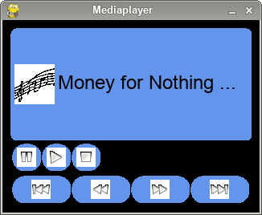

Mediaplayer
===========

The code in this directory implements the GUI for a mediaplayer. The target
screen size is 2,8" with a resolution of 320x240 pixels:

Note that the program does not implement the player logic itself, so don't
be surprised if nothing happens if you press a button.

If you want to implement this logic, take a look at my project
[simple-radio](https://github.com/bablokb/simple-radio "Simple-Radio") for
hints how to start and stop a mp3-file.
